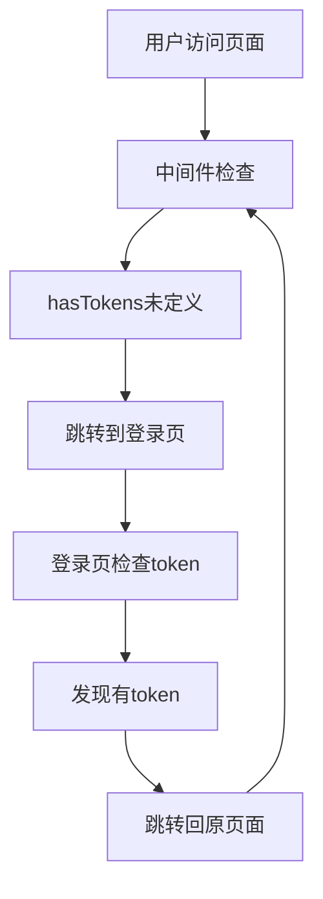
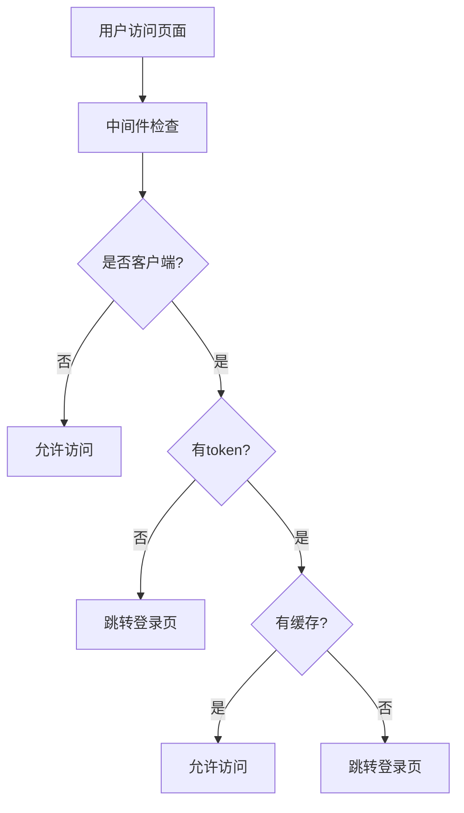

# JWT认证循环跳转问题修复

## 🚨 问题描述

用户反馈：每次刷新页面都会自动跳转到登录页面，然后过了两秒自动跳转回去，形成循环跳转。

## 🔍 问题分析

### 根本原因
1. **中间件导入问题** - `auth.ts` 中间件使用了未导入的JWT工具函数
2. **复杂的验证逻辑** - 中间件中进行了复杂的网络请求验证
3. **服务端渲染冲突** - SSR时无法访问localStorage导致token检查失败
4. **登录页面逻辑冲突** - 登录页面的token检查与中间件形成循环

### 具体问题
```javascript
// ❌ 问题代码 - 未导入函数就使用
if (!hasTokens()) {
  return navigateTo('/login')
}

// ❌ 问题代码 - 复杂的网络验证
const response = await apiRequest(`${API_BASE_URL}/auth/status`)
```

## 🛠️ 修复方案

### 1. 修复中间件导入问题

**修改前:**
```typescript
export default defineNuxtRouteMiddleware(async (to, from) => {
  if (!hasTokens()) { // ❌ 未导入函数
    return navigateTo('/login')
  }
})
```

**修改后:**
```typescript
import { hasTokens, clearTokens, apiRequest, refreshAccessToken } from '~/composables/useJwt'

export default defineNuxtRouteMiddleware(async (to, from) => {
  if (to.path === '/login' || to.path === '/debug-login') {
    return
  }
  
  if (process.client) {
    if (!hasTokens()) {
      return navigateTo('/login')
    }
  } else {
    return // 服务端渲染时暂时允许访问
  }
})
```

### 2. 简化中间件逻辑

**修改前:**
```typescript
// ❌ 复杂的网络验证逻辑
const response = await apiRequest(`${API_BASE_URL}/auth/status`)
if (!response.ok) {
  if (response.status === 401) {
    const refreshSuccess = await refreshAccessToken()
    // ... 复杂的重试逻辑
  }
}
```

**修改后:**
```typescript
// ✅ 简化的缓存检查
const cachedAuth = sessionStorage.getItem('auth_status')
if (cachedAuth) {
  const authData = JSON.parse(cachedAuth)
  if (authData.authenticated && (Date.now() - authData.timestamp < 300000)) {
    return // 允许访问
  }
}
return navigateTo('/login')
```

### 3. 优化登录页面逻辑

**修改前:**
```typescript
// ❌ 复杂的token验证
if (hasTokens()) {
  const response = await apiRequest(`${API_BASE_URL}/auth/status`)
  if (result.success && result.data.authenticated) {
    await navigateTo('/')
  }
}
```

**修改后:**
```typescript
// ✅ 简化的缓存检查
const cachedAuth = sessionStorage.getItem('auth_status')
if (cachedAuth) {
  const authData = JSON.parse(cachedAuth)
  if (authData.authenticated && (Date.now() - authData.timestamp < 300000)) {
    await navigateTo('/')
    return
  }
}
```

### 4. 创建统一的认证状态管理

新增 `composables/useAuth.ts`:
```typescript
export const setAuthStatus = (authenticated: boolean) => {
  if (process.client) {
    if (authenticated) {
      sessionStorage.setItem('auth_status', JSON.stringify({
        authenticated: true,
        timestamp: Date.now()
      }))
    } else {
      sessionStorage.removeItem('auth_status')
    }
  }
}

export const isAuthenticated = () => {
  const cachedAuth = getAuthStatus()
  if (cachedAuth && cachedAuth.authenticated) {
    return true
  }
  return hasTokens()
}
```

## 🎯 修复效果

### 修复前的问题流程


### 修复后的正常流程


## 🔧 技术改进

### 1. 性能优化
- **减少网络请求** - 中间件不再进行复杂的API验证
- **智能缓存** - 使用5分钟的认证状态缓存
- **服务端兼容** - SSR时避免客户端特有的检查

### 2. 用户体验优化
- **消除循环跳转** - 修复了无限重定向问题
- **快速响应** - 基于缓存的快速认证检查
- **平滑过渡** - 减少了不必要的页面跳转

### 3. 代码质量提升
- **模块化设计** - 分离认证逻辑到独立的composable
- **错误处理** - 改进了网络错误的处理机制
- **类型安全** - 完善了TypeScript类型定义

## 📋 测试验证

### 测试场景
1. **首次访问** - 无token时正确跳转到登录页
2. **登录成功** - 登录后正确跳转到目标页面
3. **页面刷新** - 刷新页面时不再循环跳转
4. **token过期** - token过期时正确处理
5. **网络错误** - 网络错误时的容错处理

### 预期结果
- ✅ 无循环跳转
- ✅ 认证状态正确保持
- ✅ 登录流程顺畅
- ✅ 页面加载快速

## 🚀 部署说明

### 1. 清除浏览器缓存
```bash
# 建议用户清除浏览器缓存和localStorage
localStorage.clear()
sessionStorage.clear()
```

### 2. 重启服务
```bash
# 重启前端服务
npm run dev

# 重启后端服务
mvn spring-boot:run
```

### 3. 验证修复
访问 `http://localhost:3000/debug-login` 进行调试验证

## 📝 注意事项

1. **缓存时效** - 认证缓存有效期为5分钟
2. **网络容错** - 网络错误时会使用缓存状态
3. **安全考虑** - 敏感操作仍会进行服务端验证
4. **兼容性** - 支持SSR和客户端渲染

## 🔮 后续优化

1. **Token自动刷新** - 实现更智能的token刷新机制
2. **离线支持** - 添加离线状态下的认证处理
3. **多标签页同步** - 实现多标签页间的认证状态同步
4. **性能监控** - 添加认证性能监控指标

---

## 总结

通过简化中间件逻辑、修复导入问题、优化缓存机制，成功解决了JWT认证系统的循环跳转问题。新的实现更加稳定、高效，提供了更好的用户体验。
