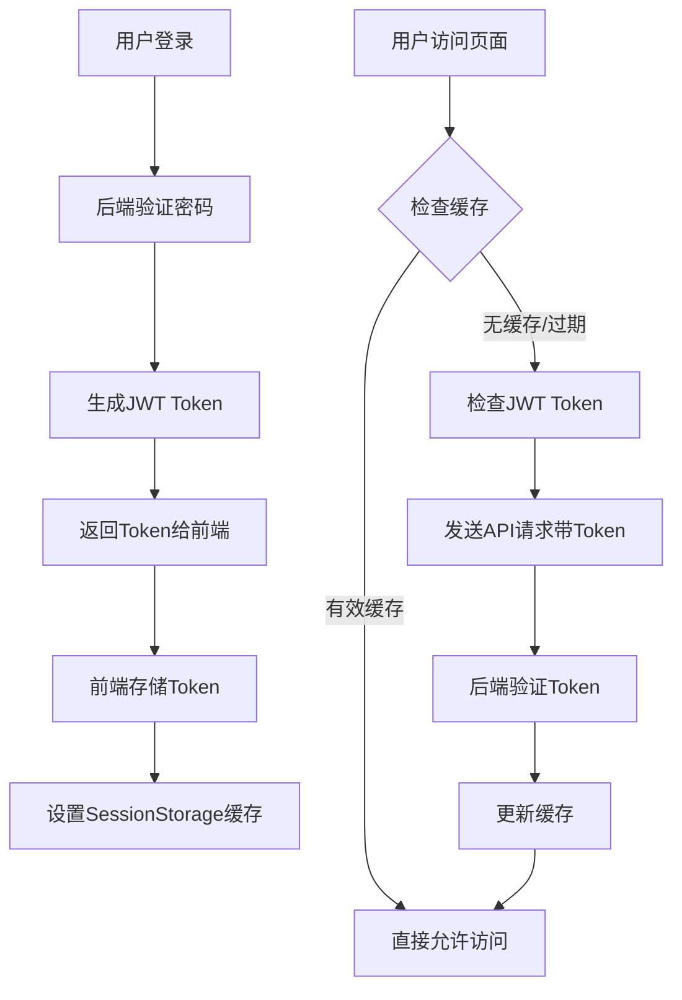

# Session vs JWT 概念澄清

## 🔍 **重要概念区分**

您提到的"session相关操作"实际上涉及两个完全不同的概念：

### 1. ❌ **HTTP Session（服务端会话）** - 已完全移除

这是传统的服务端会话管理机制：

```java
// ❌ 旧的Session方式（已移除）
@PostMapping("/login")
public ApiResponse<String> login(@RequestBody Map<String, String> request, HttpSession session) {
    if (isValid) {
        session.setAttribute("authenticated", true);  // 服务端存储状态
        return ApiResponse.success("登录成功");
    }
}

@GetMapping("/status") 
public ApiResponse<Map<String, Object>> getStatus(HttpSession session) {
    Boolean authenticated = (Boolean) session.getAttribute("authenticated");
    // ...
}
```

**特点：**
- 服务端存储用户状态
- 使用Cookie传输SessionID
- 有状态架构
- 不适合分布式系统

### 2. ✅ **Browser SessionStorage（浏览器会话存储）** - 仍在使用

这是浏览器的客户端存储机制：

```javascript
// ✅ 浏览器SessionStorage（仍在使用）
sessionStorage.setItem('auth_status', JSON.stringify({
  authenticated: true,
  timestamp: Date.now()
}))

const cachedAuth = sessionStorage.getItem('auth_status')
```

**特点：**
- 客户端存储
- 标签页级别的存储
- 用于缓存和性能优化
- 与HTTP Session完全无关

## 🎯 **当前JWT实现状态**

### ✅ **完全移除的HTTP Session代码**

1. **AuthController** - 不再使用HttpSession参数
2. **登录逻辑** - 返回JWT token而非设置session
3. **状态检查** - 基于JWT token验证
4. **拦截器** - 使用JWT拦截器而非Session拦截器

### ✅ **当前的JWT认证流程**

```java
// ✅ 现在的JWT方式
@PostMapping("/login")
public ApiResponse<Map<String, Object>> login(@RequestBody Map<String, String> request) {
    if (isValid) {
        // 生成JWT token
        String accessToken = jwtUtil.generateAccessToken("admin");
        String refreshToken = jwtUtil.generateRefreshToken("admin");
        
        Map<String, Object> tokenData = new HashMap<>();
        tokenData.put("accessToken", accessToken);
        tokenData.put("refreshToken", refreshToken);
        
        return ApiResponse.success(tokenData);
    }
}

@GetMapping("/status")
public ApiResponse<Map<String, Object>> getStatus(HttpServletRequest request) {
    // 从Authorization头获取JWT token
    String authHeader = request.getHeader("Authorization");
    String token = jwtUtil.extractTokenFromHeader(authHeader);
    
    if (token != null && jwtUtil.validateAccessToken(token)) {
        // JWT验证成功
    }
}
```

## 📊 **对比表格**

| 特性 | HTTP Session (已移除) | JWT Token (当前使用) | Browser SessionStorage (辅助缓存) |
|------|---------------------|---------------------|----------------------------------|
| **存储位置** | 服务端内存/数据库 | 客户端 | 浏览器标签页 |
| **传输方式** | Cookie | Authorization Header | 本地存储 |
| **状态管理** | 有状态 | 无状态 | 客户端状态 |
| **扩展性** | 差 | 好 | 不适用 |
| **安全性** | 中等 | 高 | 低（仅缓存） |
| **用途** | 用户认证 | 用户认证 | 性能优化 |

## 🔧 **为什么仍使用Browser SessionStorage？**

### 1. **性能优化**
```javascript
// 避免每次页面加载都进行网络验证
const cachedAuth = sessionStorage.getItem('auth_status')
if (cachedAuth && isValid(cachedAuth)) {
  // 直接允许访问，无需网络请求
  return allowAccess()
}
```

### 2. **用户体验提升**
- 减少页面加载时间
- 避免不必要的API调用
- 提供离线状态缓存

### 3. **网络容错**
```javascript
// 网络错误时使用缓存状态
try {
  const response = await apiRequest('/auth/status')
} catch (error) {
  // 网络错误，使用缓存状态
  const cachedAuth = sessionStorage.getItem('auth_status')
  if (cachedAuth && isValid(cachedAuth)) {
    return allowAccess() // 暂时允许访问
  }
}
```

## 🚀 **完整的认证架构**



## 📝 **总结**

1. **HTTP Session** ❌ - 已完全移除，不再使用服务端会话
2. **JWT Token** ✅ - 主要认证机制，无状态、安全、可扩展
3. **Browser SessionStorage** ✅ - 辅助缓存机制，提升性能和用户体验

**您的系统现在是纯JWT认证，没有任何HTTP Session依赖！** 🎉

使用Browser SessionStorage只是为了优化性能，与传统的HTTP Session完全不同。这是现代前端应用的标准做法。
